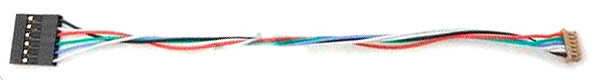
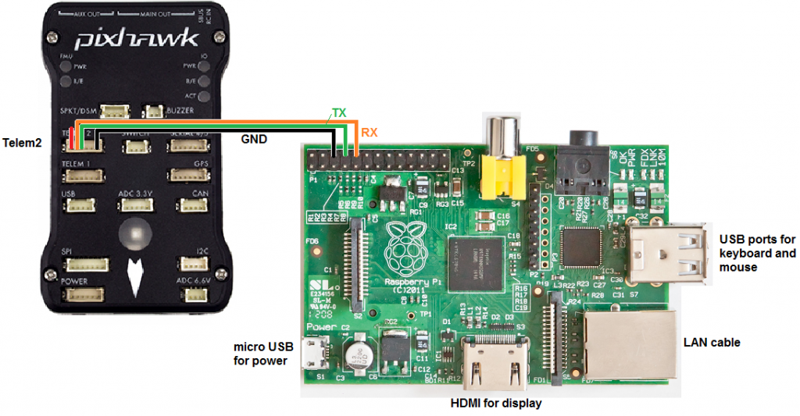

# Deployment on Raspberry Pi 3 B+

In order to use the Raspberry Pi as a companion computer we must configure the Raspberry Pi, and the Pixhawk so that they are able to communicate with each other.
Below we explain the steps in order to do so.

## Table of contents

1) [Hardware setup](#1-hardware-setup)
2) [Configure serial link](#2-configure-serial-link)
3) [Install docker](#3-install-docker)
4) [Install ArduSim2](#4-install-ardusim2)
5) [Configure network](#5-configure-network)

## 1. Hardware setup:

ArduSim communicates with the flight controller through a serial port, so we need to stablish a connection between them.

A Pixhawk controller has two telemetry ports, one tipically used for a telemetry wireless transmitter and another available for other purposes. On the other hand, a Raspberry Pi 3 B+ has a 40 pins GPIO where we can connect the telemetry port as a serial 3.3V link, with a cable similar to the one shown on the next image, which would need modifications following the instructions in this [link](http://ardupilot.org/dev/docs/raspberry-pi-via-mavlink.html). Use that guide as a reference and connect the cable as shown in the image below.




## 2. Configure serial link:

### 2.1 Pixhawk

The default configuration of the multicopter firmware is not ready to work with ArduSim, so you need to change some parameters using *[Mission Planner](https://ardupilot.org/planner/)* or *[APM Planner](https://ardupilot.org/planner2/)*. The link to communicate with the Raspberry Pi is the Serial 2 (telem2). Now follows the list of parameters to be modified, and the recommended values. The first group, SR2_EXT_STAT, and SR2_POSITION must be set to the indicated values, while the remaining parameters are optional. The second group values represent the number of messages per second that the Raspberry Pi will receive.

Parameter | value
--- | ---
SERIAL2_BAUD | 57 (equivalent to 57600 bits per second)
SERIAL2_OPTIONS | 0
SERIAL2_PROTOCOL | 1 (Mavlink v1. In future releases it will be set to 2 to use Mavlink v2)
--- | ---
SR2_ADSB | 5
SR2_EXT_STAT | 2 (required to receive battery statistics)
SR2_EXTRA1 | 5
SR2_EXTRA2 | 2
SR2_EXTRA3 | 3
SR2_PARAMS | 0
SR2_POSITION | 2 (required to locate the multicopter)
SR2_RAW_CTRL | 0
SR2_RAW_SENS | 2
SR2_RC_CHAN | 5

### 2.2 Raspberry Pi:

Raspbian, the Raspberry Pi operating system, may be using the serial port by default for the standard output, so it would send a lot of useless data to the flight controller. To avoid this, we have to keep the serial port enabled while disabling the output. Open the GUI tool in "Preferences-->Raspberry pi configuration", and enable "Serial Port" and disable "Serial Console" in the "Interfaces" tab. 

*Alternatively, you can use the console utility (`sudo raspi-config`) with the following commands, go to "Interfacing Options" - "Serial" and enable it, but then you must check the file /boot/cmdline.txt after reboot and remove the text "console=serial0,115200" if found.*

Finally we have to enable the **ttyAMA0** serial port, which is disabled by default on the Raspberry Pi model 3 to be able to use the bluetooth output through the GPIO connector (not in previous versions), so we need to swap serial and bluetooth ports. Edit the file */boot/firmware/config.txt/* and add this two lines (the first one could already be there):

```
    enable_uart=1
    dtoverlay=pi3-miniuart-bt
```

Alternatively, you can completely disable bluetooth with this overlay:
```
    dtoverlay=disable-bt
```
Next, restart the device and check that the *ttyAMA0* port is available again with the next command (a line must show: *serial0 -> ttyAMA0*):
```
    ls -l /dev
```


## 3. Install docker:

*The following instructions are copied from [here](https://docs.docker.com/engine/install/raspberry-pi-os/)*

```
	sudo apt-get update
```

```
	sudo apt-get install ca-certificates curl
```

```
	sudo install -m 0755 -d /etc/apt/keyrings
```

```
	sudo curl -fsSL https://download.docker.com/linux/raspbian/gpg -o /etc/apt/keyrings/docker.asc
```

```
	sudo chmod a+r /etc/apt/keyrings/docker.asc
```

```
	echo \
	  "deb [arch=$(dpkg --print-architecture) signed-by=/etc/apt/keyrings/docker.asc] https://download.docker.com/linux/raspbian \
	  $(. /etc/os-release && echo "$VERSION_CODENAME") stable" | \
	  sudo tee /etc/apt/sources.list.d/docker.list > /dev/null
```

```
	sudo apt-get update
```

```
	sudo apt-get install docker-ce docker-ce-cli containerd.io docker-buildx-plugin docker-compose-plugin
```

```
	sudo groupadd docker
```

```
	sudo usermod -aG docker $USER
```

```
	newgrp docker
```

## 4. Install Ardusim2:

*Since the entire ArduSim2 project is not yet completed we only start the UAV controller now*

```
	git clone https://github.com/GRCDEV/ArduSim2.git
	cd Ardusim2/uav_controller/ardupilot4_5_3/
	docker build -f REAL -t copter453 .
	Docker run -it --device=/dev/serial0 -p 192.168.1.3:9876:9876/udp --restart unless-stopped copter453
```

After the flight you can get the logs files by:
docker cp *containerID*:app/logs/ ./

## 5. Configure network:
In order to control the drone, from a ground station control (GSC) a network must be created. In theory, an ad-hoc network is the most adequete network for this type of applications. Because it allows each node in the network to communicate with another. In practice, however, we found it very complicated to create an ad-hoc network that is actually working all the time. Often there are some driver issues or the ad-hoc network is created but the cell id is different and there is no communication at all. Hence, we resorted to creating an access point in the GSC. This has several disadvantages e.g. (i) the GSC is a single point of failure, and (ii) all the drones must be in range of the GSC all of the time.

### 5.1 Set up access point (Ubuntu 24):
In order to set up an access point, execute the following commands in the console:
```
sudo nmcli con add con-name hotspot ifname wlan0 type wifi ssid drone_GRC
sudo nmcli con modify hotspot 802-11-wireless.mode ap 802-11-wireless.band a ipv4.method shared
sudo nmcli con modigy hotspot ipv4.addresses 192.168.1.1/24
sudo nmcli con modify hotspot connection.autoconnect yes
reboot
```

Notice that we are using the 802.11 wireless band **a**, one could also use **bg**. However, from previous experiments we noticed that our remote controller [Taranis X9D Plus](https://www.frsky-rc.com/product/taranis-x9d-plus-2/), is already using all of 2.4Ghz channels. 

Notice also, that this network does not use any encryption. We found that for some reason when using encryption the raspberry was not able to connect (using 5Ghz i.e. 802.11a, using 2.4Ghz i.e. 802.11bg we were able to connect). Nevertheless, if security is important than try using the following commands:
```
sudo nmcli con modify hotspot wifi-sec.key-mgmt wpa-psk
sudo nmcli con modify hotspot wifi-sec.psk "My New WiFI Password"
```

### 5.2 Connect to access point (Raspberry Pi bookworm):
In the Raspberry create a new file */etc/network/interfaces.d/wlan1* with the following content:
```
auto wlan1
iface wlan1 inet static
address 192.168.1.3
netmask 255.255.255.0
wireless-essid drone_GRC
wireless-mode managed
```

*make sure to change wlan1 to the network device you want (it could be wlan0 for instance)*

reboot, and you should be automatically connected. Make sure that the essid corresponds to the essid of the access point. Use ping to test if there is a connect.