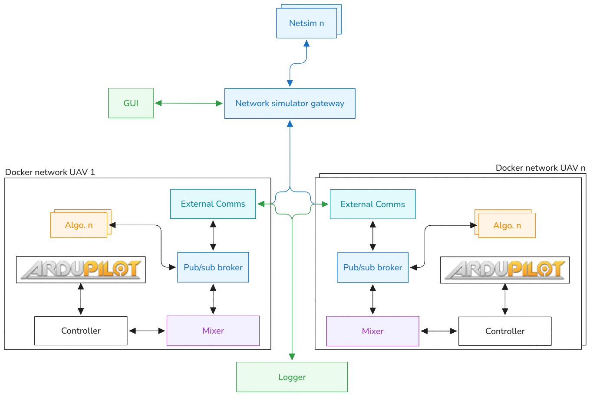
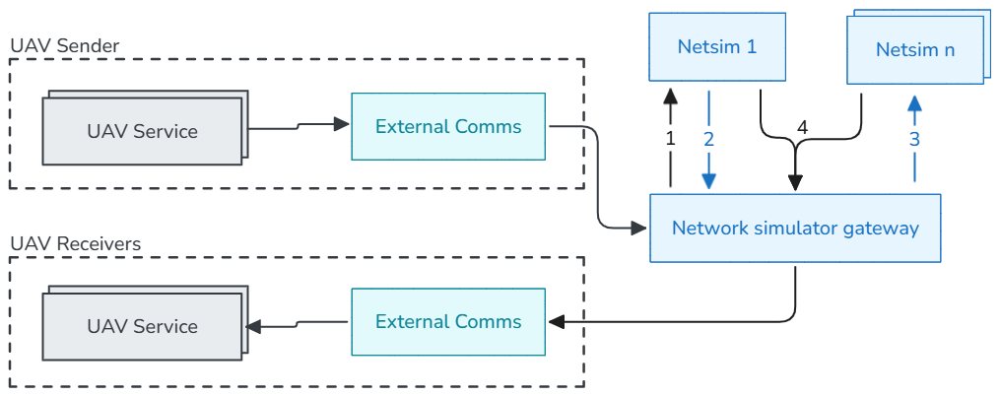

# ArduSim2

## ArduSim2 - The new modular drone control software:

ArduSim2 is software made to control drones. It is still under development. Hence, it is not to be used yet. However, it is already published and git will be used, so that in the future it will be easy to understand what design decisions are taken when and why. The code is made to be used for **real UAVs** that run on the [Ardupilot](https://ardupilot.org/) flightcontroller firmware. In order to safely test features, and learn about drones without buying the necessary hardware, ArduSim2 also includes a **simulation environment**.
If you cannot wait to use ArduSim2, then I kindly refer you to its predecessor [ArduSim](https://github.com/GRCDEV/ArduSim).

## Install

To install and use ArduSim2, follow these steps:

1. Install Git:
   - `sudo apt-get install git`
2. Clone the ArduSim2 repository:
   - `git clone https://github.com/GRCDEV/ArduSim2.git`
3. Access the GUI directory:
   - `cd ArduSim2/src/gui`
4. Execute the development server:
   - `wails dev` or `make dev`

> [!NOTE]
> If you are using a newer Linux version (example: Ubuntu 24.04) and it is not supporting `libwebkit2gtk-4.0-dev`, then you might encounter an issue in `wails doctor`: `libwebkit not found`. To resolve this issue you can install `libwebkit2gtk-4.1-dev` and during your build or run use the tag `-tags webkit2_41` (e.g. `wails dev -tags webkit2_41` or simply execute `make dev`).

## Compile

To compile ArduSim2 into a standalone executable, use the Wails build command from inside the `src/gui` directory:

```bash
wails build
```

> [!NOTE]
> Similarly, if you encounter the webkit incompatibility on newer Linux distributions, remember to append the build tag:
> `wails build -tags webkit2_41` or `make build`

## Deploy

For instructions on deploying ArduSim2 on a Raspberry Pi, please refer to the [Raspberry Pi Deployment Guide](docs/Deploy_raspberry_pi.md).

For instructions on setting up a Kubernetes cluster (configuring nodes, manager node initialisation, obtaining the kubeconfig, publishing images to Docker Hub, and opening the required ports), please refer to the [Kubernetes Setup Guide](docs/kubernetes_setup.md).

## Repository structure

In this section, I explain how this repository is structured so you can easily navigate through its numerous folders.

The main folder contains the following key files and directories:

1. **LICENSE**: the MIT License which explains to you what you can do with this code.
2. **README.md**: the readme file explaining ArduSim2.
3. **src/**: contains the source code for the GUI, algorithms, controllers, mixers, and communication modules.
4. **docs/**: contains documentation and developer guides.
5. **scripts/**: utility scripts for the project.
6. **tools/**: auxiliary tools.
7. **test/**: testing related files.
8. **simulations/**: saved simulation scenarios or related files.
9. **resources/**: assets and other resources.

ArduSim2 is a modular project that heavily depends on containers (Docker) for its backend services. Each module in the `src/` directory (except the GUI) generally represents a container and contains:

1. **README.md**: more information about the specific container.
2. **Source code**: the implementation of the service.
3. **Dockerfile**: a dockerfile necessary to create the docker image.

### Use of branches:

This GitHub repository uses branches for organizational purposes
It includes two branches:

1. **main**: This branch represents versions of ArduSim2 that are fully working and ready for 'production'.
2. **develop**: This branch is the branch that is used for active development. The code here, is the newest code but might still have bugs that need to be fixed. Hence, it is not ready to be put on the main branch. Only after thorough implementation testing, and tests on real UAVs, the code can to the main branch.
3. **feature**: Since multiple people might want to develop new code at the same time (although at the moment I am alone), a new sub-branch has to be created for each new feature. This sub-branch must have a descriptive name, and will be used to track small changes on the feature under development. Once a feature has been implemented, the code should go to the develop branch in order for it to be tested.

## Architecture & Data Flow

ArduSim2 follows a distributed, containerized architecture.



The typical message flow between components is illustrated below:



## Core Communication Modules

ArduSim2 uses several specialized modules for internal and external communication across the simulation:

- **[Communication Module](src/communication_module/README.md)**: A custom MQTT-like publish/subscribe UDP broker for internal communication.
- **[External Comms](src/external_comms/README.md)**: A gateway bridge connecting a single UAV's local messaging bus to the swarm-wide network simulator.
- **[NetSim Gateway](src/netsim_gateway/README.md)**: The central router between the UAV fleet and the network simulation layer.
- **[NetSim](src/netsim/README.md)**: A distributed network simulator node that models how radio messages propagate between UAVs in a swarm.

## Components & Customization

ArduSim2 allows you to easily add new functionalities. Below you can find the implemented components and the developer guides to add your own.

### Implemented Algorithms

The following algorithms are available under `src/algorithms/`. Each one runs as an independent container and is configurable through the GUI.

| Algorithm                                       | Description                                                                                  |
| ----------------------------------------------- | -------------------------------------------------------------------------------------------- |
| [Mission](src/algorithms/mission/README.md)     | Follows a predefined KML route, sending waypoints to the UAV controller.                     |
| [Follow Me](src/algorithms/follow_me/README.md) | Master/slave swarm behaviour where slave UAVs maintain formation around a designated master. |

To add a new algorithm, see the [Adding Algorithms guide](docs/adding_algorithms.md).

### Implemented Controllers

The following UAV controllers are available under `src/controllers/`.

| Controller                                                 | Description                                                                                                     |
| ---------------------------------------------------------- | --------------------------------------------------------------------------------------------------------------- |
| [UAV Controller](src/controllers/uav_controller/README.md) | The ArduCopter 4.5.3 Controller service. Connects to the ArduCopter SITL or real flight controller via MAVLink. |

To add a new controller, see the [Adding Controllers guide](docs/adding_controllers.md).

### Implemented Mixers

The following mixers are available under `src/mixers/`.

| Mixer                               | Description                                                                                                                                  |
| ----------------------------------- | -------------------------------------------------------------------------------------------------------------------------------------------- |
| [Mixer](src/mixers/mixer/README.md) | The central orchestrator for each UAV. It arbitrates movement suggestions from algorithms and forwards the final decision to the controller. |

To add a new mixer, see the [Adding Mixers guide](docs/adding_mixers.md).
