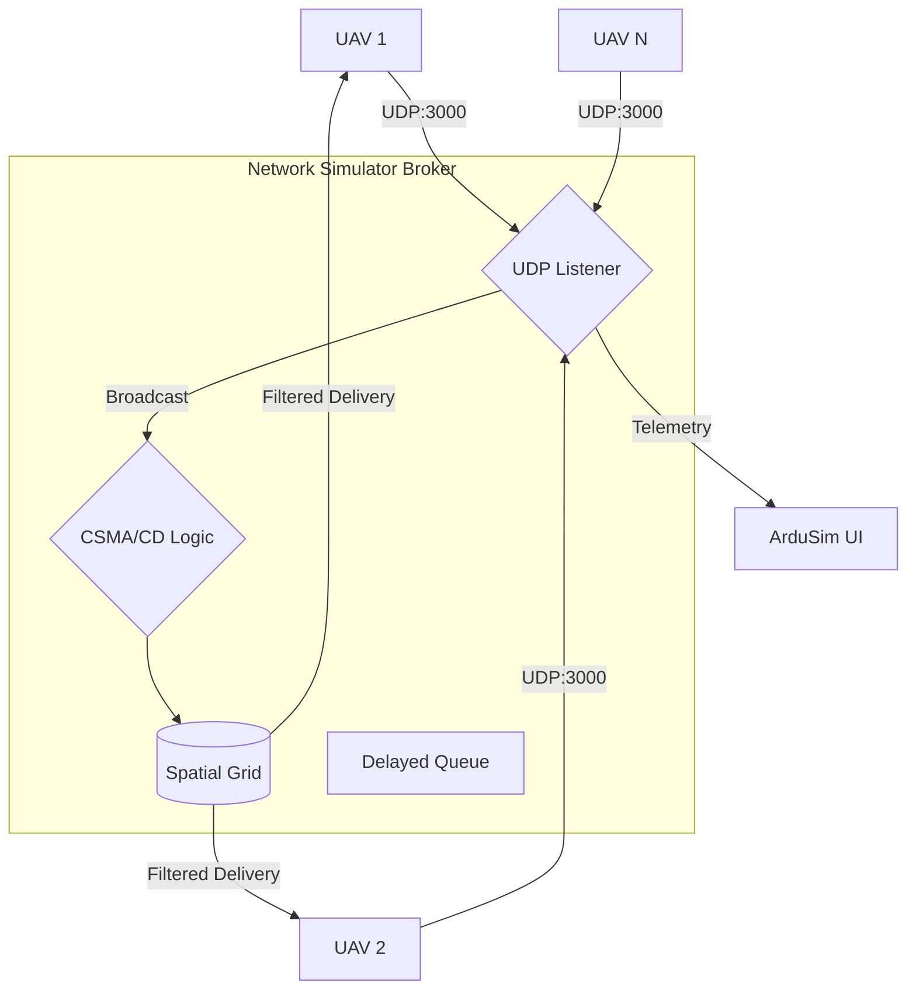

# Network Simulator Broker

[](https://www.rust-lang.org/)
[](https://opensource.org/licenses/MIT)
[]()

The **Network Simulator Broker** is a high-performance Rust microservice designed to simulate a realistic wireless communication environment for Unmanned Aerial Vehicles (UAVs). It acts as a central UDP broker that manages message propagation while enforcing physical and logic constraints typical of ad-hoc wireless networks.

---

## 🛰️ Architecture Overview

The simulator uses a spatial-aware event-driven architecture to handle thousands of messages with minimal latency.



---

## ✨ Key Features

-   **Wireless Simulation**: Full CSMA/CD implementation including carrier sensing, collision detection, and exponential backoff retries.
-   **Spatial Grid Optimization**: O(1) lookup for nearby nodes using a voxel-based spatial partitioning system.
-   **Global Broadcasts**: Special support for system-wide commands (GCS) that bypass spatial constraints using an empty `uav_id`.
-   **Physical Constraints**:
    -   **Distance Loss**: Configurable maximum range (Default: **1350m**).
    -   **Hardware Buffering**: Simulates finite RX buffers; drops packets on overflow.
    -   **Temporal Overlap**: Detects colliding transmissions within the same time window.
-   **Telemetry Relay**: Real-time aggregation of UAV states for external monitoring tools.

---

## 🚀 Getting Started

### Prerequisites
-   [Rust Stable](https://rustup.rs/) (1.70+)
-   [Docker](https://www.docker.com/) (Optional)

### Using Cargo
```bash
# Clone the repository and navigate to the directory
cd network_simulator

# Run in release mode for best performance
cargo run --release -- --port 3000 --mode debug
```

### Using Docker
```bash
# Build the image
docker build -t network-simulator .

# Run the container
docker run -d -p 3000:3000/udp --name ardu-net-sim network-simulator
```

---

## 🛠️ CLI Reference

| Flag | Long Option | Description | Default |
| :--- | :--- | :--- | :--- |
| `-p` | `--port` | Port to listen for incoming UDP datagrams | `3000` |
| `-b` | `--buffer-size` | Receiving buffer size per node (bytes) | `163840` |
| `-m` | `--mode` | Logging mode: `debug`, `debug-important`, `prod` | `debug` |
| | `--logger-ip` | Remote logger IP (Required in `prod` mode) | - |
| | `--logger-port` | Remote logger Port (Required in `prod` mode) | - |

---

## 📡 Communication Protocol

All communication happens via UDP using JSON-encoded messages.

### 1. Telemetry (Node Registration)
Sent by UAVs to announce their presence and position.
```json
{
  "topic": "telemetry",
  "payload": {
    "uav_id": "drone_01",
    "payload": {
      "nr_gps_online": 10,
      "position": { "lat": 40.41, "lon": -3.70, "alt": 50.0, "relative_alt": 50.0, "heading": 90 },
      "speed": { "vx": 5, "vy": 0, "vz": 0 },
      "type": "copter",
      "status": "ACTIVE",
      "flight_mode": "GUIDED",
      "battery": 85,
      "time_boot_ms": 15000,
      "version": "1.0"
    }
  }
}
```

### 2. Broadcast (Standard vs Global)
- **Standard**: Uses `uav_id` to calculate range and collisions.
- **Global**: Use `uav_id: ""` to reach all UAVs instantly (system commands).
```json
{
  "topic": "broadcast",
  "payload": {
    "uav_id": "drone_01", 
    "payload": [72, 101, 108, 108, 111] 
  }
}
```

### 3. Subscribe
External tools (GCS, UI) send this to receive a stream of all UAV telemetry.
```json
{ "topic": "subscribe" }
```

---

## 🧠 Simulation Logic

1.  **Ingress**: Packet is parsed and timestamped.
2.  **Carrier Sensing**: If sender's region is occupied by another transmitter, wait (retries: 5).
3.  **Spatial Filtering**: Identify receivers within the radio horizon (1350m).
4.  **Hardware Check**: For each receiver, verify if it is already "busy" receiving or if its buffer is full.
5.  **Dispatch**: Valid packets are enqueued and flushed to the UDP dispatcher.

---

## 📊 Monitoring

Terminate the process (`Ctrl+C`) to display a detailed performance and network health report:
- Total throughput (Received/Delivered).
- Packet Loss Breakdown (Distance, Buffer, Collision).
- Latency and retry statistics.
