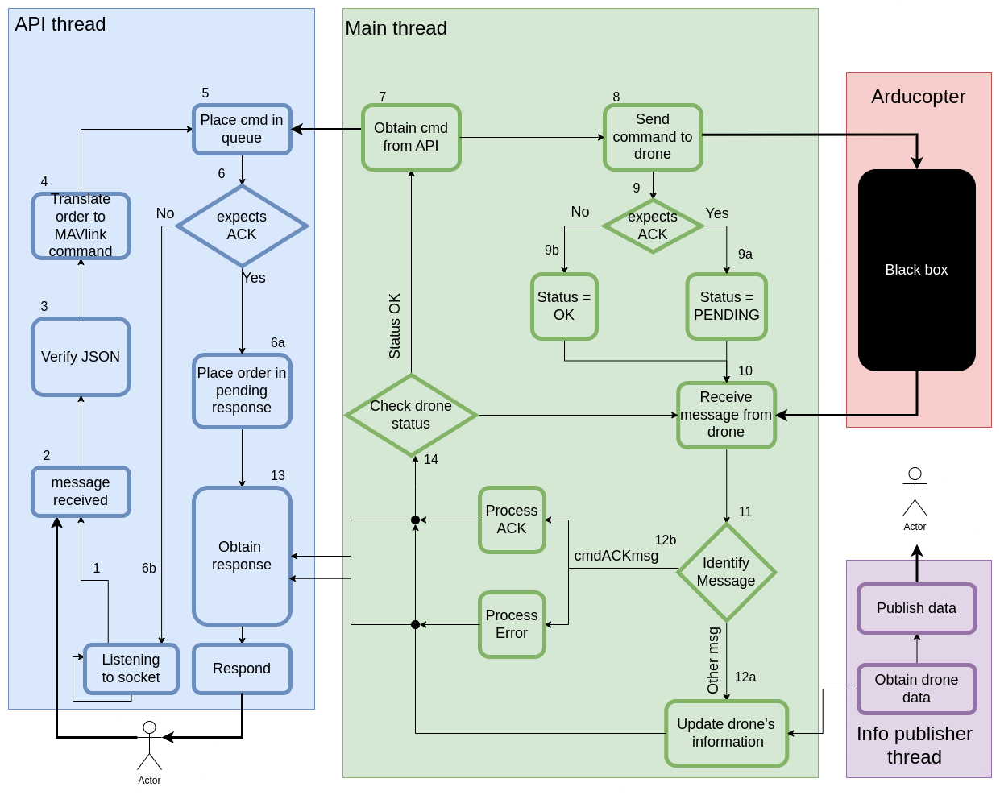

# UAV controller code: ardupilot version 4.5.3

*Author: Jamie Wubben*

This is the ArduCopter version 4.5.3 Controller service, which is a main part of Ardusim 2.
The main idea behind this code is that a user/system can send JSON messages to an API. These messages are then translated into MAVlink messages and send to the drone.

# Table of Contents
1. [Usage:](#1-usage)
  	1. [API endpoints:](#11-api-endpoints)
    	- [Set message interval](#a-set-message-interval)
    	- [Request message](#b-request-message)
    	- [Arm](#c-arm)
    	- [Disarm](#d-disarm)
    	- [Set flightmode](#e-set-flightmode)
    	- [Take off](#f-take-off)
    	- [Land](#g-land)
    	- [Move to position](#h-move-to-position)
2. [Ardupilot:](#2-ardupilot)
3. [Code:](#3-code)
  	- [Threads:](#31-threads)
  	- [Dataflow:](#32-dataflow)
  	- [Structure:](#33-structure)
    	- [Command:](#a-command)
    	- [Message:](#b-message)
    	- [Drone:](#c-drone)
    	- [Connection:](#d-connection)

## 1. Usage:

In order to use this service, you have three options:

1. Directly using **java:** to run this code directly run
  ```
  java -jar Arducopter453Controller.jar config.json
  ```
  Also make sure to run the Arducopter instance
  ```
  ./arducopter4_5_3 -S --base-port 5760 --home 39.482594,-0.346265,0.0,0.0 --model + --defaults copter.parm --sim-port-in 5501 --sim-port-out 5502 --rc-in-port 5503 --irlock-port 9005
  ```
2. With **docker:** to run this code using a docker container, run 
	```
	docker built -f SITL -t copter453 .
	```
3. With **docker compose:** this is only if you want to run the entire system including other services, but it should not be done from here.

When you run the Arducopter453Controller service, a configuration file is used. This file is a JSON and must follow the following JSON scheme:
```
{
  "$schema": "http://json-schema.org/draft-07/schema#",
  "type": "object",
  "properties": {
    "LOGGING": { "type": "string", "enum":  ["TRACE_TO_FILE", "TRACE_TO_CONSOLE","DEBUG_TO_CONSOLE", "INFO_TO_CONSOLE"]},
    "GCS_ID": { "type": "integer" },
    "API_PORT": { "type": "integer" },
    "CONNECTION_TYPE": { "type": "string", "enum": ["TCP", "SERIAL"] },
    "DRONE_PORT": { "type": "integer" },
    "DRONE_IP": { "type": "string" },
    "SERIAL_PORT": { "type": "string" },
    "BAUDRATE": { "type": "integer" },
    "PUBLISHING_PERIOD": { "type": "number" },
    "PUBLISHING_IP": { "type": "string" },
    "PUBLISHING_PORT": { "type": "integer" }
  },
  "required": ["LOGGING","GCS_ID", "API_PORT", "CONNECTION_TYPE", "PUBLISHING_PERIOD", "PUBLISHING_IP", "PUBLISHING_PORT"],
  "allOf": [
    {
      "if": {
        "properties": { "CONNECTION_TYPE": { "const": "SITL" } }
      },
      "then": {
        "required": ["DRONE_PORT", "DRONE_IP"]
      }
    },
    {
      "if": {
        "properties": { "CONNECTION_TYPE": { "const": "SERIAL" } }
      },
      "then": {
        "required": ["SERIAL_PORT", "BAUDRATE"]
      }
    }
  ]
}
```

Below, we explain each parameter in more detail:

- Logging: 
	- TRACE_TO_FILE: logging at the lowest level (TRACE), written to a file. This is useful when used with real UAVs so that if something goes wrong you have all the information.
	- TRACE_TO_CONSOLE: logging at the lowest level (TRACE), written to the console. This is useful when you have some difficult problem to debug.
	- DEBUG_TO_CONSOLE: Logging at DEBUG level, written to the console. This is useful when you need to debug something.
	- INFO_TO_CONSOLE: Logging at INFO level, written to the console. This is usefull for everyday operations. 
- GCS_ID: The ID of the ground control station (i.e. this service). By default, this is 255, and this should only be changed if you have multiple GCSs.
- API_PORT: The port at which you can connect to the API. Put it at any port you want as long is the port is not used already.
- CONNECTION_TYPE:
	- TCP: Connecting via TCP using MAVLink to a simulated arducopter instance.
	- SERIAL: Connecting via Serial connection using MAVlink to a real flightcontroller.
- DRONE_PORT: *only used when CONNECTION_TYPE = STIL* The port of the SITL instance. This port must correspond to the `--base-port` parameter, when you start the SITL instance.
- DRONE_IP: *only used when CONNECTION_TYPE = STIL*  The ip of where the SITL is running. This will most likely be localhost i.e "127.0.0.1".
- SERIAL_PORT: *only used when CONNECTION_TYPE = SERIAL* The Serial port to connect to a real flightcontroller.
- BAUDRATE: *only used when CONNECTION_TYPE = SERIAL* The baudrate of the serial connection.
- PUBLISHING_PERIOD: The time in ms after which the drone will publish its data (e.g. location, battery, status, etc.)
- PUBLISHING_IP: The ip address of the service (i.e. communication module) that will receive the data of the drone.
- PUBLISHING_PORT: The port of the service (i.e. communication module) that will receive the data of the drone. 

### 1.1 API endpoints:

When the program is running, one can send UDP messages to the API, and the drone will behave accordingly. The following endpoints exist: 

#### a) Set message interval
Set the interval at 4Hz between messages for a particular MAVLink message ID. 
Will send a [MAV CMD SET MESSAGE INTERVAL](https://mavlink.io/en/messages/common.html#MAV_CMD_SET_MESSAGE_INTERVAL) message.

Example:
```
{
	"endpoint": "SetMessageInterval",
	"messageID": 25
}
``` 

#### b) Request message
Request the target system(s) emit a single instance of a specified message. 
Will send a [MAV CMD REQUEST MESSAGE](https://mavlink.io/en/messages/common.html#MAV_CMD_REQUEST_MESSAGE).

Example:
```
{
	"endpoint": "RequestMessage",
	"messageID": 25
}
```

#### c) Arm
Will arm the drone:
Will send a [MAV CMD COMPONENT ARM DISARM](https://mavlink.io/en/messages/common.html#MAV_CMD_COMPONENT_ARM_DISARM) message, with arm = 1
Notice that after around 10 seconds the vehicle will automatically disarm again if the flightmode is not changed after arming.

Example:
```
{
	"endpoint": "Arm"
}
```

#### d) Disarm
Will Disarm the drone:
Corresponds to sending a [MAV CMD COMPONENT ARM DISARM](https://mavlink.io/en/messages/common.html#MAV_CMD_COMPONENT_ARM_DISARM) message, with arm = 0

Example:
```
{
	"endpoint": "Disarm"
}
```

#### e) Set flightmode
Will change the flightmode of the drone
Corresponds to sending a [MAV CMD DO SET MODE](https://mavlink.io/en/messages/common.html#MAV_CMD_DO_SET_MODE) message.

Example:
```
{
	"endpoint": "SetFlightmode",
	"flightmode": "GUIDED"
}
```

Possible flightmode are (more exist but these are the most common):
- STABILIZE
- GUIDED
- AUTO
- LOITER
- RTL
- BRAKE
- LAND


#### f) Take off
Takes off the drone to a set altitude. This will only work after (i) arming the drone, (ii) setting the flightmode to GUIDED. 
Corresponds to sending a [MAV CMD TAKEOFF](https://mavlink.io/en/messages/common.html#MAV_CMD_NAV_TAKEOFF) message.

Example:
```
{
	"endpoint": "Takeoff",
	"altitude": 10.0
}
```


#### g) Land
Land the drone.
Corresponds to sending [MAV CMD DO SET MODE](https://mavlink.io/en/messages/common.html#MAV_CMD_DO_SET_MODE) message with flightmode LANDED_ARMED.

Example:
```
{
	"endpoint": "Land"
}
```

#### h) Move to position
Move the drone to a location set by latitude, longitude, and altitude
Notice that this message will not expect an ack from the flightcontroller.
Corresponds to sending a [SET POSITION TARGET GLOBAL INT](https://mavlink.io/en/messages/common.html#SET_POSITION_TARGET_GLOBAL_INT) message.

Example:
```
{
	"endpoint": "MoveToPosition",
	"latitude": 39.48123904418849,
	"longitude": -0.3459353223274813,
	"altitude": 15
}
```

## 2. Ardupilot: 

The Ardupilot folder contains the Software In The Loop (SITL) of ArduCopter 4.5.3, and the copter.parm file. We created these files for quick installation. However, they are just the standard files obtained after following the ArduCopter SITL setup instructions. Which can be found [here](https://ardupilot.org/dev/docs/building-setup-linux.html#building-setup-linux).
The instructions given by ArduCopter are a bit long (and not all of them are necessary). One could reproduce the same file by following the instructions below. However, most likely you will run into errors since some python packages might be missing. Just read the error messages and install these packages. I deliberately do not show which packages you should install because they change between arducopter versions and hence are not useful in the future.

```
	git clone https://github.com/ArduPilot/ardupilot.git
	cd ardupilot
	git checkout tags/Copter-4.5.3 (where 4.5.3 represents any ArduCopter version to be used)
	git submodule update --init --recursive 
	Tools/environment_install/install-prereqs-ubuntu.sh -y
    . ~/.profile
    cd ArduCopter
    ../Tools/autotest/sim_vehicle.py -w
```

The command will start the compilation process, and when it finishes it should show a message like "IMU1 is using GPS", which means that the virtual copter is running. Then, use "Ctrl+C" to close the running program. The multicopter runnable file *arducopter* is located in *ardupilot/build/sitl/bin*. Copy that file, and also the file *ardupilot/Tools/autotest/default_params/copter.parm*

## 3. Code:

This folder contains the code for the UAV controller service, which is (arguably) the most important service of ArduSim2. If everything goes well, this code should not be changed. However, for new versions of ArduCopter or perhabs for ArduPlane and ArduRover this might be a good starting point. It might also be useful to add new features. The code that I implemented maybe only has 20% of all the features of ArduCopter. However, in my opinion, it already does 80% of the work. Hence, this code provides a way to arm, take-off, hover, move, and land ArduCopter 4.5.3. In order to use it, an ArduCopter instance must be running. This might be on a real UAV, but it will probably be the SITL version. So if you use it outside the docker container, make sure to start ArduCopter using the following command:

```
./arducopter4_5_3 -S --base-port 5760 --home 39.482594,-0.346265,0.0,0.0 --model + --defaults copter.parm --sim-port-in 5501 --sim-port-out 5502 --rc-in-port 5503 --irlock-port 9005
```

Notice that the parameter "--base-port 5760" should correspond with the "DRONE_PORT" key in the config.json file (for more explanation, see the chapter below).


### 3.1 Threads:

The code runs four threads

- Heartbeat: The Heartbeat thread is responsible for sending a Heartbeat MAVlink message once every second. This is a requirement from the MAVlink protocol.
- InfoPublisher: The Info publisher thread is responsible for sending the information from the drone (e.g. location, status, etc.) It is published UDP, and the IP and Port are set in the json.config file.
- API thread: The API thread is responsible for receiving orders (in JSON format), and converting them to MAVlink messages.
- Main thread: The Main thread (Arducopter453Controller), is responsible for initializing the project, and forwarding the API orders to the drone.

### 3.2 Dataflow:

In order to work with this code it is essential that the data flow is well understood. Therefore, I created the following figure, and explain each step in more detail.



 We start with the *API thread*:
*notice that the numbers in the figure correspond with the steps explained below. Nevertheless, these numbers are only indicating the steps, and in fact we could start at any point with the explanation.*

1. The API thread is listening to the socket, waiting for messages.
2. The API thread receives a JSON order from an actor (e.g. a user, a program, etc.)
3. This JSON order is verified i.e. the JSON must contain a key "ENDPOINT", and the value of this key must be one of the existing endpoints (check API section for more information).
4. The JSON order is translated into a Command. Each Command is its own class, which corresponds to a specifc MAVlink command (MAV_CMD), and inherits from the abstract class "Command". Each Command has the following fields:
	- a *int* **commandID**: the ID of the command corresponding to [MAV_CMD](https://mavlink.io/en/messages/common.html#mav_commands)
	- a *object* **payload:** MAVlink message obtained from the JSON order,
	- a *int* **mavId:** the receiver ID which is automaticaly set, and is equal to the drone ID,
	- a *int* **gcsID:** the sender ID which is automatically set, and is equal to this service,
	- a *boolean* **awaitsACKMessage:** indicating wheter this command is expecting a ack message from the ArduPilot instance.
5. Once the command is created it is placed in a queue.
6. We check if the command is expecting an ACK:
	a. **Yes:** the command is placed in a pending response que
	b. **No :** the API thread returns to step 1 i.e.listening to the socket.

At the same time the *main thread* is also active.

7. It obtains commands from the API (if there is any).
8. It sends this command to the drone using the MAVlink connection.
9. We check if the command is expecting an ACK:
	- **yes:** The drone's status is set to PENDING
	- **No :** The drone's status is set (remains) to OK
10. We wait to receive a message from the ArduCopter instance.
11. This message is identified. Each message is its own class, which corresponds to a specific MAVLink message and inherits from the abstract class Message. There are many possible MAVLink messages as shown by the [documentation](https://mavlink.io/en/messages/common.html#messages). The message is identified by the MessageFactory class. We only identify a few messages (the onces that are used/received now), all the other messages are discared. 
12. Each message class has its own *process* method, depending on this method some action is performed:
	a. In most cases the data from the message is read, and the drone's data is updated. For instance, a GPS message arrives and the drone's latitude, longitud, and altitude are processed and stored.
	b. Sometimes (i.e. after sending a command), we receive a [Command_ACK message](https://mavlink.io/en/messages/common.html#COMMAND_ACK). This message will indicate wheter the command we sent has been executed correctly or not. The *commandAckMessage* class, has (as any Message class) a *process* method. In this method, we check wheter the command ack message corresponds with the last command we send to the ArduCopter instance. If this is the case, we obtain this last command, and perform either *Process ACK* or *Process Error*. Each command class has its own implementation of these methods. But in general the following happends:
		- Process ACK: (i) the drone status is set to OK, and (ii) the API is notified to send an ACK to the user.
		- Process Error: (i) the drone status is set. Most often it is set to OK. Although this might seem strange at first, this is perfectly normal. This because the other alternative is to set it to FATAL_ERROR. Meaning that the drone will stop its flight and land. In many cases, this is too much and resulting to OK is good enough so that other services can solve this problem.
13. If the API is notified, it will obtain the response (ACK or NACK) and respond to the original sender.
14. The main thread continues by checking the drone status. There are three states:
	- OK: the main thread continues by obtaining commands from the API.
	- PENDING: the main thread does not check commands from the API. (this because we shouldn't send a new command to the drone before it has acknowledged the last one), and directly returns to receiving messages from the drone.
	- FATAL_ERROR: (not depicted), the drone tries to land and shutsdown.       

While all of this is happening the *info publisher thread* is obtaining the data from the drone (period is set in the json.config file), and publish this data using UDP.


### 3.3 Structure:

This code is all placed in the root package *grc.ardusim2* and is subdivided into four packages: (i) command, (ii) connection, (iii) drone, (iv) message. 
In the root package, we can find the four threads, and a configuration class that reads the configuration from the config.json file.
Each package is carefully designed, I will now explain how it was designed, and how one can add extra features.

#### a) Command:

The command package corresponds to the MAVlink commands that can be sent to the drone. In order to add a new command one must follow a few steps. We will use the arm command as an example:

1. Create a new class called "Arm", that extends from the "Command" class.

2. Search on the [MAVlink website commands](https://mavlink.io/en/messages/common.html#mav_commands) the desired command, in this case [MAV CMD COMPONENT ARM DISARM](https://mavlink.io/en/messages/common.html#MAV_CMD_COMPONENT_ARM_DISARM) Arm.

3. The construct should be similar to the code below. You should change the commandID with the ID of the corresponding command, and adapt the payload to whatever is required. The payload is almost always created by using the [Command protocol](https://mavlink.io/en/services/command.html#command-protocol). When using this protocol ArduPilot wil respond with an ACKMessage so the expectsACKMEssage must be set to true (this is done by default).
	```
	super();
	super.commandID = MavCmd.MAV_CMD_COMPONENT_ARM_DISARM.ordinal();
	super.payload = CommandLong.builder()
	        .targetSystem(drone.getMavID())
	        .targetComponent(0)
	        .command(MavCmd.MAV_CMD_COMPONENT_ARM_DISARM)
	        .param1(1)
	        .param2(0)
	        .build();
	super.expectsACKMessage = true; //default
	```

4. Implement the *processACK()* method. In this method you should implement the behaviour when your command has been acknowledged. Do whatever you like, but make sure to include the following:
	```
	drone.setStatus(Drone.Status.OK);
	api.respond(this, "ACK");
	```
5. Implement the *processError()* method. In this method you should implement the behaviour when your command has NOT been acknowledged. Do whatever you like (please log an error/warning), but make sure to include the following:
	```
	api.respond(this, "NACK");
    drone.setStatus(Drone.Status.OK);
	```
	The drone status might also be set to FATAL_ERROR, but do realize that this will land the drone.

6. Implement the *public static Function<JSONObject, Boolean> isValidMessage()* method. This method is important but cannot be inherited, so make sure to implement it! You can check the other commands for examples, but here you should check whether the JSON message is valid or not and return a boolean.

7. Now the command code is done but you still need to use it. For that make sure to change the *CommandFactory* class and add the case of your command.

8. Now you can use the command internally but you probably also want to be able to access it via the API. So make sure to change the method *initializeEndpoints()* in the *APIThread* class. Make sure to use the same name as in the CommandFactory.

Now you should be able to use the new command.

#### b) Message:

The message package corresponds to the MAVlink messages that a drone sends to this service. In order to receive a specific message, one must first request this message using the [Set message interval](#a-set-message-interval) or [Request message](#b-request-message) command. The Ardupilot instance, will then respond with this message (and in case of using *set message interval* keep on sending this message four times a second). In order to add a new message one must follow a few steps. We will use the *AutopilotVersionMessage* class as an example

1. Create a new class called *AutopilotVersionMessage* that extends the "Message" class.

2. Search on the [MAVLINK website messages](https://mavlink.io/en/messages/common.html#messages) the desired message, in this case [AUTOPILOT_VERSION](https://mavlink.io/en/messages/common.html#AUTOPILOT_VERSION). Read the documentation in order to understand which datafields you want to use, and how to request them.

3. In the constructor cast your generic *Mavlink<?> inMsg* to the specific MAVLink message like this:
	```
	AutopilotVersion msg = (AutopilotVersion) inMsg.getPayload();
	```

4. Implement your functionality in the *process()* method

5. Add your new class to the *MessageFactory*

#### c) Drone:

The drone package is a small package that contains just three classes. One is the *Drone* class, which holds the current information of the drone e.g. position, speed, battery, etc. This information is updated using the MAVLink messages (inside specific message classes), and is used by the *infoPublisherThread* to send the information of the drone to another system. The other class in this package is an enum called *FlightModes*. It contains the different flightmodes that a drone can use. This enum is used in the [Set flightmode](#e-set-flightmode) command (to set the flightmode), and also in the *heartbeat message* to determine the current flightmode (by reading the custommode field). **Flightmodes are different for each ardupilot version** to if you want to use this code for ArduPlane, make sure to change this enum. The available flightmodes can be found in the [arducopter documentation](https://ardupilot.org/copter/docs/parameters.html#fltmode1). The value in this list corresponds with the custom mode that is sent in the heartbeat message. The last class is called *FlightMode* (notice it is not FlightModes). The FlightMode class is holds more information about the flightmode. In particular, it includes the basemode field. This field is set by the flightcontroller. This basemode include information suchs as armed, stabilize, auto, etc. These values (a bitmask) can be found in the [base mode field](https://mavlink.io/en/messages/minimal.html#MAV_MODE_FLAG). When changing the flightmode custom mode (as we do with the [Set flightmode](#e-set-flightmode) command), this base mode might change automatically.

#### d) connection:

The connection package is another small package. It holds classes to connect to an MAVlink device. For now, we have two different connection types (and I do not foresee that new types will be added). We have a serial connection in which we connect to a serial port using the [jSerialComm](https://github.com/Fazecast/jSerialComm) library. This connection should be used for real UAVs. We also have a TCPConnection which uses TCP. This connection should be used for SITL simulations. Each connection type/class should inherit from the *Connection* class, since this class already implements sending a message (using MAVlink v1), and receiving (and identifying) a MAVlink message.